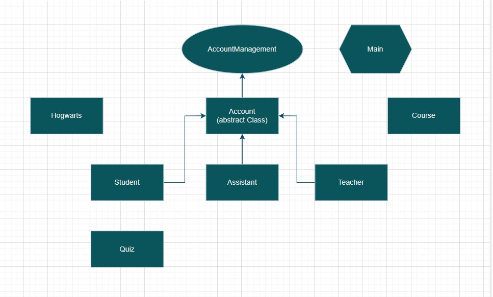

# Project Title

Creating Hogwarts School Management System In Terminal

# Description

In This Project You can Manage a Hogwarts School Named "hopeHaogwarts"
You can sign Up as Teacher or Student or Assistant

### Dependencies

To Run This Program You Should Have SomeThing In Your Local Machine:
1. Gradle 8.6 Version And org.json Library (You can get it with add a Command in Build.gradle File)
2. JDK is The most important thing to run this program
3. You Should have List and ArrayList and UUID library

### Installing

You Can Download My Program In Github 
you should download all Folders
You Should not do any modifictions in files to use the program

### Executing program

To Run The Program:
1. Download All Files and Folders in the same shape as in my github
2. go to src -> main -> java
3. open CMD Or Terminal(For Windows)
4. Write : javac Main.java (Do This For All Classes)
5. Write : java Main
6. Enjoy The Program

### Help

if you cant run the Main.java Class make sure that you compile all Classes

Remember at first its only have an assistant named "AmirAliNasiri" and there is no Courses or Teachers or students and You must signUp as this roles First

you can see access of any users at runTime in the options menu

### Authors

The Only Contributor : 
AmirAli Nasiri 
Github --> https://github.com/amirnasiri23

## Works Flow

## Version History

* 0.1
    * Initial Release
* 0.2
    * Complete AccountManagment(Inteface) and Account(Class) in abstract mode
* 0.3
    * hash passwords in Class Account
* 0.4
    * Complet Course Class
* 0.5
    * creat Assistant and Teacher and Student Classes Extands Account Class
* 0.6 
  * creat hogwarts Class and make an object named "hopeHogwarts" in runmenu Function in Main Class 
* 0.7
    * complete the Main Class
* 0.8 
    * craet Quiz Class and an Inctance in Main Class With 4 questions and a randomnumber generator function for Students that want to have a quiz 
* 0.9 
    * handle signUp allocation for Teachers and Students

## License

This project is licensed under the [AmirAli Nasiri] License - see the LICENSE.md file for details

## Acknowledgments

🔗 [Different patterns to design your classes](https://refactoring.guru/design-patterns/catalog)

🔗 [Visual Paradigm for drawing UML diagrams](https://www.visual-paradigm.com/)

🔗 [Types of UML Diagrams](https://www.lucidchart.com/blog/types-of-UML-diagrams)

🔗 [Guide to UUID in Java](https://www.baeldung.com/java-uuid)
